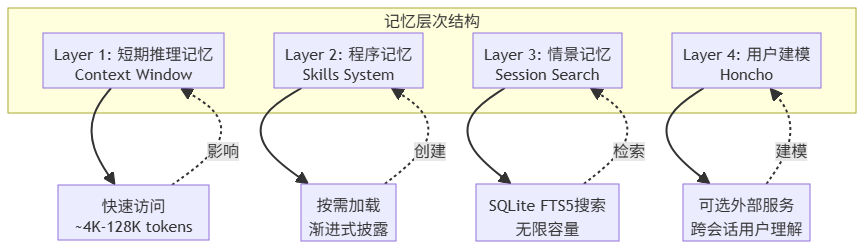
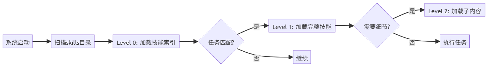
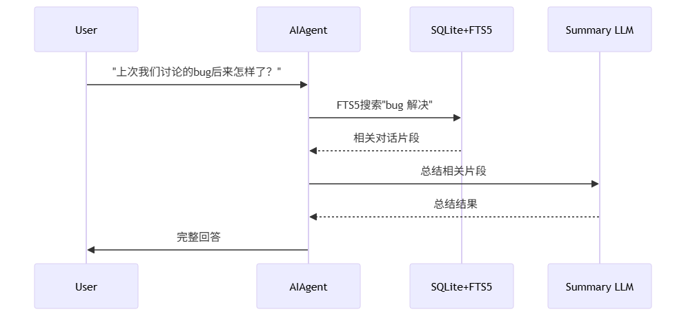
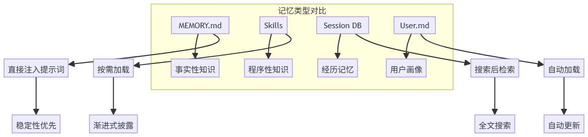
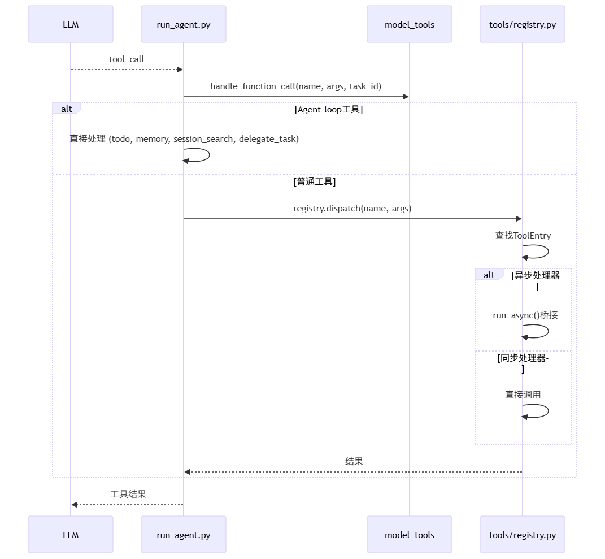
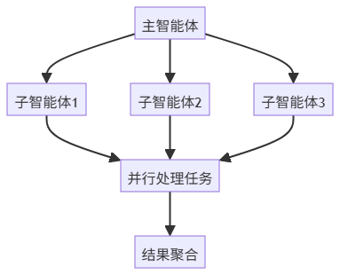
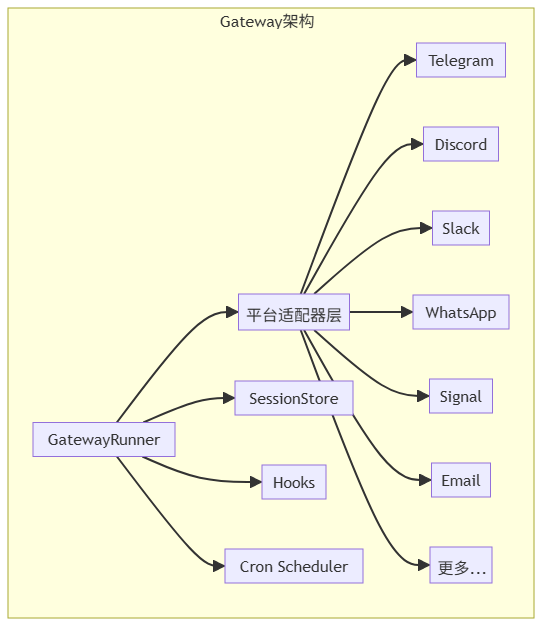
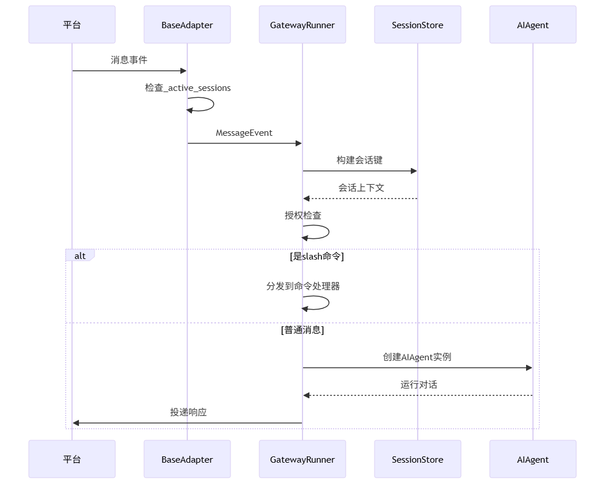
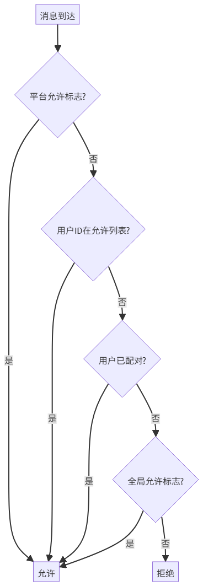

# Hermes Agent 核心架构笔记

---

## 1. 多协议适配层

Hermes 支持三种外部 API 协议，通过适配器统一为内部中间表示（IR）：

### 1.1 三种协议格式

**① chat_completions（经典对话接口）**
```json
{
  "model": "gpt-4",
  "messages": [
    {"role": "system", "content": "You are helpful"},
    {"role": "user", "content": "Hello"}
  ]
}
```

**② codex_responses（多模态 + Agent 原生接口）**
```json
{
  "model": "gpt-4.1",
  "input": [
    {"role": "user", "content": [{"type": "text", "text": "..."}]}
  ],
  "tools": [...],
  "response_format": "..."
}
```

**③ anthropic_messages（Claude 风格接口）**
```json
{
  "model": "claude-3",
  "messages": [
    {"role": "user", "content": [
      {"type": "text", "text": "Hi"},
      {"type": "tool_use", "name": "..."}
    ]}
  ]
}
```

### 1.2 协议转换流程

```
外部协议（3种）
┌────────┬──────────────┬──────────────┐
│  chat  │  responses   │  anthropic   │
└────────┴──────────────┴──────────────┘
                 ↓
          【Ingress Adapter】
                 ↓
        🧠 Hermes IR（统一语义层）
      ┌──────────────────────────┐
      │  Message / ToolCall /    │
      │  ToolResult / Thought    │
      └──────────────────────────┘
                 ↓
          【Egress Adapter】
                 ↓
          输出到目标模型协议
```

> 代码位置：`run_agent.py` → `_build_api_kwargs()`（Egress 出口）、`agent/anthropic_adapter.py`（Anthropic 双向转换）

**① api_mode 自动检测（`run_agent.py` `AIAgent.__init__`）：**

```python
# run_agent.py — 协议模式自动推断（真实代码）
if api_mode in {"chat_completions", "codex_responses", "anthropic_messages"}:
    self.api_mode = api_mode                          # 显式指定
elif self.provider == "openai-codex":
    self.api_mode = "codex_responses"
elif self.provider == "anthropic" or "api.anthropic.com" in self._base_url_lower:
    self.api_mode = "anthropic_messages"
elif self._base_url_lower.rstrip("/").endswith("/anthropic"):
    self.api_mode = "anthropic_messages"              # 第三方 Anthropic 兼容端点
else:
    self.api_mode = "chat_completions"                # 默认

# GPT-5.x 系列强制使用 Responses API（/v1/chat/completions 会拒绝）
if self.api_mode == "chat_completions" and self._model_requires_responses_api(self.model):
    self.api_mode = "codex_responses"
```

**② Egress：`_build_api_kwargs()` 三路分发（`run_agent.py`）：**

```python
def _build_api_kwargs(self, api_messages: list) -> dict:
    """根据 api_mode 构建目标协议的请求参数"""

    if self.api_mode == "anthropic_messages":
        # IR(OpenAI格式) → Anthropic Messages API 格式
        from agent.anthropic_adapter import build_anthropic_kwargs
        return build_anthropic_kwargs(
            model=self.model, messages=api_messages,
            tools=self.tools, max_tokens=self.max_tokens,
            reasoning_config=self.reasoning_config,
            is_oauth=self._is_anthropic_oauth, ...
        )

    if self.api_mode == "codex_responses":
        # IR → OpenAI Responses API 格式
        instructions = api_messages[0]["content"] if api_messages[0]["role"] == "system" else ""
        return {
            "model": self.model,
            "instructions": instructions,
            "input": self._chat_messages_to_responses_input(payload_messages),
            "tools": self._responses_tools(),
            "reasoning": {"effort": reasoning_effort, "summary": "auto"},
            "store": False,
        }

    # chat_completions — 默认路径
    # 清理 codex 专有字段（codex_reasoning_items、call_id）后直接传递
    return {"model": self.model, "messages": sanitized_messages, "tools": self.tools, ...}
```

**③ Anthropic Egress 转换细节（`agent/anthropic_adapter.py`）：**

```python
# 消息转换：OpenAI IR → Anthropic 格式
def convert_messages_to_anthropic(messages, base_url=None) -> (system, anthropic_msgs):
    """system 角色提取为独立参数；assistant 的 tool_calls → tool_use blocks"""
    for m in messages:
        if role == "system":
            system = content              # Anthropic 的 system 是独立参数
        elif role == "assistant":
            blocks = _extract_preserved_thinking_blocks(m)  # 保留 thinking blocks
            for tc in m.get("tool_calls", []):
                blocks.append({"type": "tool_use", "id": tc["id"],
                               "name": tc["function"]["name"],
                               "input": json.loads(tc["function"]["arguments"])})
        elif role == "tool":
            # tool result → {"type": "tool_result", "tool_use_id": ..., "content": ...}

# 工具 schema 转换：OpenAI → Anthropic
def convert_tools_to_anthropic(tools) -> list:
    """{"function": {"name", "description", "parameters"}}
     → {"name", "description", "input_schema"}"""
    return [{"name": fn["name"], "description": fn["description"],
             "input_schema": fn["parameters"]} for fn in tools]
```

**④ API 调用分发（`run_agent.py` `_interruptible_api_call`）：**

```python
def _call():
    if self.api_mode == "codex_responses":
        result["response"] = self._run_codex_stream(api_kwargs, client=...)
    elif self.api_mode == "anthropic_messages":
        result["response"] = self._anthropic_client.messages.create(**api_kwargs)
    else:  # chat_completions
        result["response"] = client.chat.completions.create(**api_kwargs)
```

**关键设计：** 内部 IR 始终使用 OpenAI 格式（`{"role", "content", "tool_calls"}`），仅在 `_build_api_kwargs` 出口处做一次协议转换。响应解析后也统一回写为 IR 格式，确保 Agent 循环代码与协议无关。

---

## 2. 对话消息流转

标准的消息轮次遵循严格的角色交替规则：

```
[User]
   ↓
[Assistant]
   ↓ (if tool_calls)
[Tool]  ← 不插入用户信息，直接返回工具结果
   ↓
[Assistant]
   ↓
[User]
```

---

## 3. 每轮迭代的完整生命周期

```
① 生成 task_id
② 追加 user message 到对话历史
③ 构建/复用缓存的 system prompt
④ 检查是否需要预压缩（>50% context）
⑤ 构建 API messages（三种格式分别处理）
⑥ 注入临时 prompt 层（budget 警告、context 压力提示）
⑦ 如果是 Anthropic，应用 prompt caching 标记
⑧ 发起可中断 API 调用
⑨ 解析响应：
   ├── 有 tool_calls → 执行 → 追加结果 → 回到步骤⑤
   └── 无 tool_calls → 持久化 session，flush 记忆，返回最终响应
```

---

## 4. 压缩与持久化

### 4.1 两种触发场景

| 场景 | 触发阈值 | 说明 |
|------|----------|------|
| **预压缩**（API 调用前） | 对话超过上下文窗口的 **50%** | 常规压缩，在主循环内触发 |
| **网关自动压缩** | 对话超过上下文窗口的 **85%** | 更激进，在轮次之间运行 |

### 4.2 压缩前的准备工作

1. **刷新记忆到磁盘** — 防止压缩丢弃重要信息
2. **通知记忆插件**（`on_pre_compress`） — 让外部插件在消息被丢弃前提取有价值信息
3. 执行核心压缩算法

### 4.3 压缩算法 — `ContextCompressor.compress()`

#### Phase 1：裁剪旧工具输出（无 LLM 调用，零成本）

```python
messages, pruned_count = self._prune_old_tool_results(
    messages, protect_tail_count=self.protect_last_n,
    protect_tail_tokens=self.tail_token_budget,
)
```

- 把旧的 `tool` 消息内容替换为占位符 `"[Old tool output cleared to save context space]"`
- 只裁剪 >200 字符的内容

#### Phase 2：确定保护边界（Head / Tail）

```
┌───────────────────────────────────────────────────┐
│  HEAD (受保护)    │  MIDDLE (被压缩)  │  TAIL (受保护)  │
│  前3条消息        │  中间的所有对话    │  按token预算保护 │
│  (系统提示+首轮)  │                   │  ~20K tokens    │
└───────────────────────────────────────────────────┘

```

- **头部**：保护前 `protect_first_n`（默认 3）条消息
- **尾部**：通过 `_find_tail_cut_by_tokens()` 按 token 预算动态保护（约 `context_length × 0.50 × 0.20`），不切断 `tool_call / result` 对

**具体示例：**

| idx | 类型 | 内容 | token |
|-----|------|------|-------|
| 0 | system | 你是代码助手 | 200 |
| 1 | user | 帮我写API | 500 |
| 2 | assistant | 好的这是方案 | 800 |
| 3 | user | 再加缓存 | 400 |
| 4 | assistant | 解释缓存 | 900 |
| 5 | user | 调用外部API | 300 |
| 6 | assistant | 发起 tool_call | 200 |
| 7 | tool | tool_result | 1200 |
| 8 | assistant | 总结结果 | 700 |
| 9 | user | 再优化性能 | 400 |
| 10 | assistant | 给优化建议 | 1000 |

**分区结果：**

```
┌──────────────────────────────────────┐
│            HEAD                      │
│         [0][1][2]                    │
├──────────────────────────────────────┤
│       MIDDLE（压缩/摘要）             │
│           [3][4]                     │
├──────────────────────────────────────┤
│       TAIL（token预算保护）           │
│      [5][6][7][8][9][10]             │
└──────────────────────────────────────┘
```

- **HEAD**（`protect_first_n = 3`）：保留 [0] system、[1] user、[2] assistant
- **TAIL**（从后往前累加至 token 预算）：[10]→[9]→[8]→[7]→[6]→[5]，注意 [6] 是 tool_call、[7] 是 tool_result，不可切断
- **MIDDLE**（[3][4]）：被 LLM 摘要压缩，极端情况下直接丢弃

#### Phase 3：LLM 摘要生成（`_generate_summary()`）

调用辅助模型（便宜/快速）生成结构化摘要，模板包含：

- **Goal** — 目标
- **Progress** — 进展（Done / In Progress / Blocked）
- **Key Decisions** — 关键决策
- **Resolved Questions** — 已解决的问题
- **Pending User Asks** — 待处理请求
- **Relevant Files** — 相关文件
- **Remaining Work** — 剩余工作
- **Critical Context** — 不可丢失的关键上下文

### 4.4 压缩后的收尾工作

1. **注入 todo 快照** — 把当前待办列表追加到压缩后的消息中，防止任务清单丢失
2. **重建系统提示** — 清除缓存并重新构建 system prompt
3. **SQLite 会话分割** — 结束旧会话（标记为 `compression`），创建新会话并设置 `parent_session_id` 形成链式关系，标题自动编号（如 `"调试bug"` → `"调试bug (2)"`）
4. **清除文件读取去重缓存** — 压缩后原始内容已丢失，需要允许重新读取

### 4.5 持久化

每轮对话结束后，消息增量写入 SQLite（`hermes_state.py`），支持 FTS5 全文搜索。

---

## 5. 多层记忆系统



| 层级 | 名称 | 特性 | 限制 |
|------|------|------|------|
| **L1** | 上下文窗口 | 超过 50% 窗口自动预压缩 | 90 次迭代限制，会话级生命周期 |
| **L2** | Skills 程序记忆 | 渐进式披露，结构化技能文件 | — |
| **L3** | Session Search 情景记忆 | FTS5 全文索引 + LLM 总结 | 无容量限制 |
| **L4** | Honcho 用户建模 | 跨会话画像、语义搜索 | ~200ms 延迟 |

### 5.1 Layer 1：短期推理记忆（Context Window）

LLM 固有的上下文能力，管理当前对话的即时状态。

**关键特性：**
- 自动压缩：超过 50% 上下文窗口时触发
- 工具调用上限：默认 90 次迭代
- 会话级生命周期：重启后不保留

### 5.2 Layer 2：程序记忆（Skills System）

Skills 代表智能体的"程序性记忆"——不仅记录发生了什么，还记录**如何做得更好、要避免什么以及如何验证成功**。

**技能创建时机：**
- 完成复杂任务（5+ 次工具调用）后
- 遇到错误并找到解决方案后
- 用户纠正其方法后

**目录结构：**
```
~/.hermes/skills/
├── my-skill/
│   ├── SKILL.md
│   ├── references/
│   ├── templates/
│   └── scripts/
```

**渐进式披露（3 级加载）：**

| Level | 方法 | 内容 | Token 消耗 |
|-------|------|------|-----------|
| 0 | `skills_list()` | 仅名称和描述 | ~3K（40+ 技能） |
| 1 | `skill_view(name)` | 加载完整内容 | 按需 |
| 2 | 子章节加载 | 具体子章节 | 最小化 |



**SKILL.md 格式**（遵循 agentskills.io 开放标准）：

```yaml
---
name: my-skill
description: Brief description of what this skill does
version: 1.0.0
author: Your Name
platforms: [macos, linux]
metadata:
  hermes:
    tags: [python, automation]
    category: devops
---
```

```markdown
# Skill Title
Brief intro.

## When to Use        — 触发条件
## Quick Reference    — 速查表
## Procedure          — 分步操作
## Pitfalls           — 已知陷阱
## Verification       — 验证方法
```

### 5.3 Layer 3：情景记忆（Session Search）

所有历史对话存储在 SQLite（`~/.hermes/state.db`），使用 FTS5 全文索引，无容量限制。

> 代码位置：`tools/session_search_tool.py`

**工作流程：**
1. 执行 FTS5 搜索查询会话数据库
2. 检索相关对话片段
3. 使用 LLM 总结检索结果
4. 将总结注入当前对话



**核心搜索函数 `session_search()`：**

```python
def session_search(query, role_filter=None, limit=3, db=None, current_session_id=None):
    """两种模式：
    1. 无 query → _list_recent_sessions() 返回最近会话元数据（零 LLM 成本）
    2. 有 query → FTS5 搜索 + LLM 摘要
    """
    # FTS5 搜索，获取前50条匹配结果
    raw_results = db.search_messages(query=query, role_filter=role_list, limit=50)

    # 按 session_id 分组去重，解析子会话到父会话（压缩/委派产生的子会话）
    for result in raw_results:
        resolved_sid = _resolve_to_parent(raw_sid)  # 沿 parent_session_id 链回溯到根
        if resolved_sid == current_lineage_root:     # 跳过当前会话
            continue

    # 并行摘要：对每个命中的会话，加载对话 → 截断到匹配位置附近 → LLM 总结
    results = await asyncio.gather(*[
        _summarize_session(text, query, meta) for _, _, text, meta in tasks
    ])
```

**智能截断 `_truncate_around_matches()`：**

```python
def _truncate_around_matches(full_text, query, max_chars=100_000):
    """将对话截断到 max_chars，选择覆盖最多匹配位置的窗口。
    优先级：1.完整短语匹配 → 2.词共现（200字符内） → 3.单独词位置
    窗口选择：25% 在匹配前，75% 在匹配后"""
```

**摘要生成 `_summarize_session()`：**

```python
async def _summarize_session(conversation_text, query, session_meta):
    """调用辅助模型生成聚焦摘要，提示模型关注：
    1. 用户想要什么  2. 采取了什么行动  3. 关键决策和结论
    4. 重要的命令/文件/URL  5. 未解决的问题
    最多重试 3 次，temperature=0.1"""
```

**工具注册：**

```python
registry.register(
    name="session_search",
    toolset="session_search",
    schema=SESSION_SEARCH_SCHEMA,  # 提供丰富的 description 指导 LLM 何时调用
    handler=lambda args, **kw: session_search(..., db=kw.get("db"),
                                               current_session_id=kw.get("current_session_id")),
)
```

**持久记忆 vs 会话搜索对比：**

| 特性 | 持久记忆（MEMORY.md） | 会话搜索（Session Search） |
|------|----------------------|--------------------------|
| 速度 | 即时（始终在 prompt 中） | 需要搜索 + LLM |
| 容量 | ~1,300 tokens | 无限 |
| 内容类型 | 精选关键事实 | 完整历史 |

### 5.4 Layer 4：Honcho 用户建模（可选）

Honcho 是来自 Plastic Labs 的外部服务，提供 AI 驱动的用户建模层：

> 代码位置：`plugins/memory/honcho/__init__.py`（`HonchoMemoryProvider`）

```bash
hermes honcho setup
```

**核心功能：**
- **跨会话用户画像** — 构建用户偏好、沟通风格、工作习惯的持久模型
- **跨设备连续性** — 不同设备/平台的对话保持上下文连贯
- **语义搜索** — 理解语义而非仅匹配关键词（如"让我头疼的项目" → "难处理的项目"）
- **对话式理解** — 深入理解用户意图和需求

**三种召回模式（`recall_mode`）：**

| 模式 | 自动注入上下文 | 暴露工具给 LLM | 说明 |
|------|:---:|:---:|------|
| `context` | ✅ | ❌ | 纯自动，每轮注入用户画像 |
| `tools` | ❌ | ✅ | 纯手动，LLM 按需调用 4 个工具 |
| `hybrid` | ✅ | ✅ | 默认，自动 + 手动 |

**4 个工具 schema：**

```python
ALL_TOOL_SCHEMAS = [
    PROFILE_SCHEMA,   # honcho_profile — 获取用户 peer card（快速，无 LLM）
    SEARCH_SCHEMA,    # honcho_search  — 语义搜索用户记忆（返回原始片段）
    CONTEXT_SCHEMA,   # honcho_context — 自然语言提问，Honcho LLM 综合回答（成本较高）
    CONCLUDE_SCHEMA,  # honcho_conclude — 将结论写入 Honcho 持久记忆
]
```

**`HonchoMemoryProvider` 核心生命周期：**

```python
class HonchoMemoryProvider(MemoryProvider):
    def initialize(self, session_id, **kwargs):
        """初始化 Honcho 会话：
        1. 跳过 cron 上下文（cron guard）
        2. 读取 recall_mode/cadence 配置
        3. tools-only 模式延迟初始化（到第一次工具调用时）
        4. context/hybrid 模式立即初始化 + 预热上下文"""
        cfg = HonchoClientConfig.from_global_config()
        client = get_honcho_client(cfg)
        self._manager = HonchoSessionManager(honcho=client, config=cfg, ...)
        session = self._manager.get_or_create(self._session_key)
        # 预热：后台线程获取 user representation + dialectic query
        self._manager.prefetch_context(self._session_key)
        self._manager.prefetch_dialectic(self._session_key, "What should I know about this user?")

    def system_prompt_block(self):
        """首次调用时获取并缓存完整 Honcho 上下文（用户画像、peer card、AI 自我表示）
        后续调用返回缓存版本（保持 prompt caching 稳定）"""
        ctx = self._manager.get_prefetch_context(self._session_key)
        # 格式化为: ## User Representation / ## User Peer Card / ## AI Self-Representation

    def prefetch(self, query):
        """B5 成本控制：
        - tools-only 模式不注入
        - injection_frequency="first-turn" → 仅第一轮注入
        - dialectic_cadence/context_cadence 控制调用频率"""

    def sync_turn(self, user_content, assistant_content):
        """每轮结束后异步记录到 Honcho（后台线程）
        超长消息自动分块（默认 25K 字符限制）"""

    def handle_tool_call(self, tool_name, args):
        """分发 4 个工具调用：
        honcho_profile  → _manager.get_peer_card()
        honcho_search   → _manager.search_context(query, max_tokens)
        honcho_context  → _manager.dialectic_query(query, peer)
        honcho_conclude → _manager.create_conclusion(conclusion)"""

    def on_memory_write(self, action, target, content):
        """镜像内置记忆写入 → 自动同步为 Honcho conclusion"""
```

**技术实现：** `get_context()` 返回消息、结论和摘要的组合，受 token 预算限制（约 200ms 延迟）。配置存储在 `$HERMES_HOME/honcho.json`。

### 5.5 持久记忆工具（Memory Tool）

> 代码位置：`tools/memory_tool.py`（`MemoryStore` 类）

两个文件支撑的有界记忆，跨会话持久化：

| 存储 | 文件 | 用途 | 容量 |
|------|------|------|------|
| `memory` | `MEMORY.md` | Agent 个人笔记（环境事实、项目惯例、工具怪癖） | ~2,200 chars |
| `user` | `USER.md` | 用户画像（偏好、沟通风格、工作习惯） | ~1,375 chars |

**冻结快照模式（保护 prompt cache）：**

```python
class MemoryStore:
    def load_from_disk(self):
        """启动时加载 MEMORY.md + USER.md，捕获冻结快照"""
        self.memory_entries = self._read_file(mem_dir / "MEMORY.md")
        self.user_entries = self._read_file(mem_dir / "USER.md")
        # 冻结快照 → 注入 system prompt，整个会话期间不变
        self._system_prompt_snapshot = {
            "memory": self._render_block("memory", self.memory_entries),
            "user": self._render_block("user", self.user_entries),
        }

    def format_for_system_prompt(self, target):
        """返回冻结快照（load_from_disk 时捕获），NOT 实时状态。
        mid-session 写入不影响 system prompt → 保持 prefix cache 稳定"""
        return self._system_prompt_snapshot.get(target, "")

    def add(self, target, content):
        """文件锁保护 → 重新从磁盘读取 → 去重 → 容量检查 → 原子写入"""
        scan_error = _scan_memory_content(content)  # 注入/渗出检测
        if scan_error: return error
        with self._file_lock(path):
            self._reload_target(target)  # 拿到最新状态
            # ... 容量检查、去重、追加
            self.save_to_disk(target)    # 原子 temp+rename 写入
```

**安全扫描**（每次写入前）：检测 prompt injection、角色劫持、凭证渗出等威胁模式。

**工具 schema（`memory`）：** 单一工具，`action` 参数分发：

```python
# action: add / replace / remove
# target: "memory"（个人笔记）或 "user"（用户画像）
# replace/remove 用短唯一子串匹配，不需要 ID
registry.register(name="memory", toolset="memory", schema=MEMORY_SCHEMA, ...)
```

**记忆压缩与老化：** 当 MEMORY.md 接近容量时，Agent 会主动：
1. 识别冗余条目
2. 移除过时的条目
3. 将相关条目合并为更紧凑的条目

### 5.6 社区扩展：PLUR Engrams

PLUR（由 plur9 开发）是受大脑启发的记忆插件，提供以下增强功能：
- **修正变为永久知识** — 用户的纠正会自动沉淀为持久知识
- **共享情景记忆** — 多个智能体之间可以共享记忆
- **团队协作** — 团队成员可以共享记忆给其他成员

---

## 6. 技能系统深度解析

Hermes 将"记忆"拆分为四个组件（MEMORY.md 存储事实、Skills 存储程序性知识、Session DB 存储经历、USER.md 存储画像），每个组件使用不同的存储/检索/成本结构。核心原则：**prompt cache 是主阵地，必须保持稳定；其他内容通过外部工具处理。**



### 6.1 技能管理工具（`skill_manage`）

> 代码位置：`tools/skill_manager_tool.py`

```python
def skill_manage(action, name, content=None, category=None,
                 file_path=None, file_content=None,
                 old_string=None, new_string=None, replace_all=False):
    """管理用户创建的技能，分发到对应的 action handler"""

    if action == "create":    _create_skill(name, content, category)
    elif action == "edit":    _edit_skill(name, content)        # 全量重写
    elif action == "patch":   _patch_skill(name, old_string, new_string, ...)  # 首选！
    elif action == "delete":  _delete_skill(name)
    elif action == "write_file":  _write_file(name, file_path, file_content)
    elif action == "remove_file": _remove_file(name, file_path)

    # 成功后清除技能 system prompt 缓存
    if result.get("success"):
        clear_skills_system_prompt_cache(clear_snapshot=True)
```

**关键约束：**

```python
MAX_NAME_LENGTH = 64
MAX_DESCRIPTION_LENGTH = 1024
MAX_SKILL_CONTENT_CHARS = 100_000   # ~36k tokens
MAX_SKILL_FILE_BYTES = 1_048_576    # 1 MiB per supporting file
VALID_NAME_RE = re.compile(r'^[a-z0-9][a-z0-9._-]*$')
ALLOWED_SUBDIRS = {"references", "templates", "scripts", "assets"}
```

**安全扫描：** 每次创建/编辑后自动运行 `scan_skill()`，检测危险内容并阻止：

```python
def _security_scan_skill(skill_dir):
    result = scan_skill(skill_dir, source="agent-created")
    allowed, reason = should_allow_install(result)
    if not allowed:
        return f"Security scan blocked this skill ({reason}):\n{report}"
```

**`patch` 是首选更新方式** — 比 `edit` 更省 token，只有变更的文本出现在提示中。

### 6.2 技能发现工具（`skills_list` / `skill_view`）

> 代码位置：`tools/skills_tool.py`

```python
def skills_list(category=None, task_id=None):
    """渐进式披露 Tier 1：仅返回 name + description + category
    扫描所有技能目录（本地 + external dirs），按 category 排序"""
    all_skills = _find_all_skills()  # 扫描 SKILLS_DIR + external dirs
    return {"skills": all_skills, "categories": categories,
            "hint": "Use skill_view(name) to see full content"}

def skill_view(name, file_path=None, task_id=None):
    """渐进式披露 Tier 2-3：
    - 无 file_path → 返回 SKILL.md 完整内容 + linked_files 清单
    - 有 file_path → 返回具体子文件（references/api.md 等）
    搜索顺序：本地目录 → external_dirs（first match wins）
    安全检查：平台兼容性、prompt injection 检测、信任目录验证"""
```

**工具注册：**

```python
registry.register(name="skills_list", toolset="skills", schema=SKILLS_LIST_SCHEMA, ...)
registry.register(name="skill_view",  toolset="skills", schema=SKILL_VIEW_SCHEMA, ...)
```

### 6.3 技能来源与 Hub

Hermes 技能可以从多个来源获取：

| 来源 | 说明 |
|------|------|
| 官方内置 | Hermes 仓库捆绑的技能 |
| Skills.sh | Vercel 托管的社区技能市场 |
| ClawHub | OpenClaw 社区技能 |
| GitHub 仓库 | 直接从 GitHub 安装 |
| 官方可选技能 | Nous 维护的可选技能目录 |

```bash
# 从 Hub 安装技能
/hermes skills search <query>
/hermes skills install <skill-name>
/hermes skills inspect <skill-name>
```

### 6.4 技能生命周期


### 6.5 技能 vs 工具的选择

| 维度 | 选择技能 | 选择工具 |
|------|----------|----------|
| 表达方式 | 指令 + shell 命令 + 现有工具 | 需要端到端 API 集成 |
| 数据类型 | 文本为主 | 二进制数据、流式传输、实时事件 |
| 模型感知 | 按需加载（`skill_view`） | 精确感知（schema 在 system prompt 中） |
| 示例 | arXiv 搜索、git 工作流、Docker 管理 | 浏览器自动化、TTS、视觉分析 |

### 6.6 外部技能目录

从 v0.6.0 开始，支持配置额外的只读技能目录：

```yaml
skills:
  external_dirs:
    - "~/.agents/shared-skills"
    - "/mnt/team-skills"
```

- 路径会进行 shell 展开（`~`、`${VAR}`）并在启动时解析
- 外部目录**只用于技能发现** — 创建/编辑始终写入主 `~/.hermes/skills/` 目录
- `skill_view` 搜索顺序：本地目录 → external_dirs（first match wins）

### 6.7 环境变量与凭证管理

技能可以在 frontmatter 中声明需要的环境变量：

```yaml
required_environment_variables:
  - name: GITHUB_TOKEN
    description: "GitHub personal access token"
    required_for: "GitHub API access"
```

**加载时检查逻辑：**
- **本地/SSH 后端** — 缺失的值会阻止技能加载（但不会隐藏）
- **远程后端**（docker、singularity、modal、daytona） — 所有必需变量必须存在

**配置设置**（非秘密）存储在 `config.yaml`：

```yaml
skills:
  config:
    my-skill:
      option1: value1
      option2: value2
```

---

## 7. 工具系统与执行环境

### 7.1 自注册工具架构

> 代码位置：`tools/registry.py`（`ToolRegistry`）、`model_tools.py`（发现与编排）

Hermes 的工具系统采用**自注册模式**，每个工具模块在导入时调用 `registry.register()` 声明自己：

```python
# tools/registry.py — 核心注册接口
class ToolRegistry:
    def register(self, name, toolset, schema, handler,
                 check_fn=None, requires_env=None, is_async=False,
                 emoji="", max_result_size_chars=None):
        """在模块导入时由每个工具文件调用"""
        with self._lock:  # 线程安全（MCP 动态刷新可能并发写入）
            # 防止跨 toolset 覆盖（插件/MCP 不能覆盖内置工具）
            if existing and existing.toolset != toolset:
                if not (both_mcp):  # MCP-to-MCP 允许覆盖
                    logger.error("Tool registration REJECTED: shadowing")
                    return
            self._tools[name] = ToolEntry(name, toolset, schema, handler, ...)
```

**`model_tools.py` 的发现流程：**

```python
def _discover_tools():
    """导入所有工具模块 → 触发 registry.register() 调用"""
    _modules = [
        "tools.web_tools",      "tools.terminal_tool",
        "tools.file_tools",     "tools.vision_tools",
        "tools.skills_tool",    "tools.skill_manager_tool",
        "tools.browser_tool",   "tools.code_execution_tool",
        "tools.delegate_tool",  "tools.memory_tool",
        "tools.session_search_tool",  # ... 更多模块
    ]
    for mod_name in _modules:
        importlib.import_module(mod_name)  # 导入即注册

_discover_tools()                    # 内置工具
discover_mcp_tools()                 # MCP 外部服务器工具
discover_plugins()                   # 用户/项目/pip 插件
```

**依赖链（无循环导入）：**

```
tools/registry.py  (零依赖)
       ↑
tools/*.py  (导入 registry，import 时注册)
       ↑
model_tools.py  (导入 registry + 触发发现)
       ↑
run_agent.py, cli.py, batch_runner.py
```

### 7.2 工具集与过滤

| 工具集 | 包含工具 |
|--------|----------|
| `terminal` | 终端命令执行 |
| `web` | 网页搜索、提取 |
| `file` | 文件操作 |
| `browser` | 浏览器自动化 |
| `vision` | 图像分析 |
| `image_gen` | 图像生成 |
| `todo` | 任务规划 |
| `memory` | 持久记忆 |
| `skills` | 技能管理 |
| `session_search` | 会话搜索 |
| `delegation` | 子智能体委托 |
| `code_execution` | 代码执行沙箱 |

工具定义通过 `get_tool_definitions(enabled_toolsets, disabled_toolsets)` 过滤，返回可用工具列表。

### 7.3 工具分发流程



> 代码位置：`model_tools.py` → `handle_function_call()` → `registry.dispatch()`

### 7.4 终端后端架构

> 代码位置：`tools/terminal_tool.py` + `tools/environments/` 目录

Hermes 支持六种终端后端执行 shell 命令：

| 后端 | 描述 | 适用场景 |
|------|------|----------|
| `local` | 直接在主机执行 | 开发、信任用户 |
| `docker` | 隔离容器 | 安全隔离、生产 |
| `ssh` | 远程服务器 | 远程执行、沙箱 |
| `daytona` | Serverless 沙箱 | 按需扩展 |
| `singularity` | HPC 容器 | 高性能计算 |
| `modal` | Serverless | 空闲时几乎零成本 |

**配置示例：**

```yaml
terminal:
  backend: docker
  docker_image: "nikolaik/python-nodejs:python3.11-nodejs20"
  container_cpu: 1
  container_memory: 5120  # MB
  timeout: 180
```

**Docker 后端安全加固：**

```
--cap-drop ALL                        # 删除所有 Linux 能力
--security-opt no-new-privileges:true # 禁止 suid/sgid 提权
--pids-limit 256                      # 防止 fork 炸弹
--cpus / --memory                     # 资源限制
--network none (可选)                  # 完全禁用网络
```

**SSH 后端** 使用 ControlMaster 连接复用，避免每次命令建立新连接。

### 7.5 代码执行沙箱（`execute_code`）

> 代码位置：`tools/code_execution_tool.py`

```python
"""Programmatic Tool Calling (PTC) — 让 LLM 写 Python 脚本通过 RPC 调用 Hermes 工具，
将多步工具链折叠为单次推理轮次。中间结果不进入 LLM 上下文窗口。"""

# 两种传输架构：
# Local backend (UDS)：Unix domain socket RPC
# Remote backends：文件级 RPC（Docker/SSH/Modal 等）

SANDBOX_ALLOWED_TOOLS = frozenset([
    "web_search", "web_extract", "read_file",
    "write_file", "search_files", "patch", "terminal",
])

DEFAULT_TIMEOUT = 300        # 5 分钟
DEFAULT_MAX_TOOL_CALLS = 50  # 每次执行最大 RPC 调用数
MAX_STDOUT_BYTES = 50_000    # 50 KB
```

**工作流程：**
1. 父进程生成 `hermes_tools.py` 桩模块（包含 RPC 函数）
2. 父进程启动 RPC 监听器（UDS socket 或文件轮询）
3. 子进程执行 LLM 编写的 Python 脚本
4. 工具调用通过 RPC 回到父进程分发
5. 仅 stdout 返回给 LLM — 中间 tool results 不进入上下文

### 7.6 子智能体委托（`delegate_task`）

> 代码位置：`tools/delegate_tool.py`



```python
"""每个子智能体获得：
- 全新对话（不继承父历史）
- 独立 task_id（独立终端会话、文件缓存）
- 受限工具集（可配置 + 始终屏蔽的工具）
- 聚焦的系统提示
父上下文只看到委托调用和摘要结果，不看到子智能体的中间过程。"""

DELEGATE_BLOCKED_TOOLS = frozenset([
    "delegate_task",   # 禁止递归委托
    "clarify",         # 禁止用户交互
    "memory",          # 禁止写共享 MEMORY.md
    "send_message",    # 禁止跨平台副作用
    "execute_code",    # 子智能体应逐步推理
])

MAX_DEPTH = 2  # parent(0) → child(1) → grandchild rejected(2)
_DEFAULT_MAX_CONCURRENT_CHILDREN = 3  # 最大并行子智能体数

# 共享迭代预算：子智能体消耗父的 iteration_budget
sub_agent.iteration_budget = self.parent.iteration_budget
```

### 7.7 MCP 集成

> 代码位置：`tools/mcp_tool.py`（~2274 行）

Model Context Protocol（MCP）允许 Hermes 连接到外部工具服务器：

```yaml
mcp_servers:
  github:
    command: "npx"
    args: ["-y", "@modelcontextprotocol/server-github"]
    env:
      GITHUB_TOKEN: ${GITHUB_TOKEN}
    timeout: 120          # 每次工具调用超时
    connect_timeout: 60   # 初始连接超时
  remote_api:
    url: "https://my-mcp-server.example.com/mcp"
    headers:
      Authorization: "Bearer sk-..."
```

**架构特性：**
- **两种传输**：Stdio（command + args）和 HTTP/StreamableHTTP（url）
- **后台事件循环**：专用守护线程上的 `_mcp_loop`，每个 MCP 服务器作为长生命周期 asyncio Task
- **自动重连**：指数退避，最多 5 次重试
- **安全**：Stdio 子进程环境变量过滤、错误消息中的凭证剥离
- **Sampling 支持**：MCP 服务器可通过 `sampling/createMessage` 请求 LLM 补全
- **动态刷新**：响应 `notifications/tools/list_changed` 事件自动重新发现工具
## 8. 消息网关与多平台接入

### 8.1 Gateway 架构概述

> 代码位置：`gateway/run.py`（`GatewayRunner`，~9500 行）、`gateway/session.py`、`gateway/delivery.py`

消息网关是长期运行的 asyncio 进程，将 Hermes 连接到 19+ 个外部消息平台。



**关键文件：**

| 文件 | 职责 |
|------|------|
| `gateway/run.py` | `GatewayRunner` — 主循环、slash 命令、消息分发 |
| `gateway/session.py` | `SessionStore`（SQLite + JSONL 双后端）、`SessionSource`、`build_session_key()` |
| `gateway/delivery.py` | `DeliveryRouter` — 出站消息投递（origin/home channel/explicit target） |
| `gateway/pairing.py` | `PairingStore` — DM 配对流程（OWASP 安全标准） |
| `gateway/hooks.py` | `HookRegistry` — 事件钩子系统 |
| `gateway/config.py` | `GatewayConfig`、`Platform` 枚举（19 个平台）、`SessionResetPolicy` |
| `gateway/platforms/base.py` | `BasePlatformAdapter` — 适配器抽象基类 |

```python
# gateway/run.py — GatewayRunner 核心状态（真实代码）
class GatewayRunner:
    def __init__(self, config: Optional[GatewayConfig] = None):
        self.config = config or load_gateway_config()
        self.adapters: Dict[Platform, BasePlatformAdapter] = {}
        self.session_store = SessionStore(
            self.config.sessions_dir, self.config,
            has_active_processes_fn=lambda key: process_registry.has_active_for_session(key),
        )
        self.delivery_router = DeliveryRouter(self.config)

        # 运行中的 Agent 实例（用于中断支持）
        self._running_agents: Dict[str, Any] = {}          # session_key → AIAgent
        self._pending_messages: Dict[str, str] = {}         # 中断期间排队的消息

        # Agent 缓存：跨消息复用 AIAgent 实例以保留 prompt caching
        self._agent_cache: Dict[str, tuple] = {}            # session_key → (AIAgent, config_sig)

        # 每会话模型覆盖（/model 命令）
        self._session_model_overrides: Dict[str, Dict[str, str]] = {}

        # 事件钩子系统
        self.hooks = HookRegistry()
        # DM 配对
        self.pairing_store = PairingStore()
```

### 8.2 平台适配器

> 代码位置：`gateway/platforms/base.py`（`BasePlatformAdapter`）+ 各平台文件

**支持的 19 个平台：**

```python
# gateway/config.py
class Platform(Enum):
    LOCAL = "local"
    TELEGRAM = "telegram"       DISCORD = "discord"
    WHATSAPP = "whatsapp"       SLACK = "slack"
    SIGNAL = "signal"           MATTERMOST = "mattermost"
    MATRIX = "matrix"           HOMEASSISTANT = "homeassistant"
    EMAIL = "email"             SMS = "sms"
    DINGTALK = "dingtalk"       API_SERVER = "api_server"
    WEBHOOK = "webhook"         FEISHU = "feishu"
    WECOM = "wecom"             WECOM_CALLBACK = "wecom_callback"
    WEIXIN = "weixin"           BLUEBUBBLES = "bluebubbles"
    QQBOT = "qqbot"
```

```python
# gateway/platforms/base.py — 适配器抽象基类（真实代码）
class BasePlatformAdapter(ABC):
    def __init__(self, config: PlatformConfig, platform: Platform):
        self.config = config
        self.platform = platform
        self._running = False

        # 活跃会话追踪（用于中断支持）
        self._active_sessions: Dict[str, asyncio.Event] = {}
        self._pending_messages: Dict[str, MessageEvent] = {}
        self._background_tasks: set[asyncio.Task] = set()

    # 子类必须实现的抽象方法：
    # async def connect(), async def disconnect(), async def send(), ...
```

**UTF-16 长度处理**（Telegram 的 4096 限制以 UTF-16 code units 计量）：

```python
def utf16_len(s: str) -> int:
    return len(s.encode("utf-16-le")) // 2
```

### 8.3 消息处理流程



> 代码位置：`gateway/run.py` → `_handle_message()`

```python
async def _handle_message(self, event: MessageEvent) -> Optional[str]:
    """核心消息处理管线（真实代码摘要）"""
    source = event.source

    # 1. 内部事件（如后台进程完成通知）跳过授权
    if getattr(event, "internal", False):
        pass
    # 2. 无 user_id 的消息（频道转发、匿名管理员）静默丢弃
    elif source.user_id is None:
        return None
    # 3. 未授权用户 → DM 中触发配对流程，群组中静默忽略
    elif not self._is_user_authorized(source):
        if source.chat_type == "dm":
            code = self.pairing_store.generate_code(...)
            # 发送配对码给用户
        return None

    # 4. 构建会话键
    _quick_key = self._session_key_for_source(source)
    # 5. 检查 slash 命令 → 分发
    # 6. 检查是否有正在运行的 Agent → 中断/排队
    # 7. 获取或创建会话 → 构建上下文 → 运行 Agent
    # 8. 投递响应
```

### 8.4 会话键系统

> 代码位置：`gateway/session.py` → `build_session_key()`

会话键是确定性的路由标识符，编码完整的消息来源上下文：

```python
def build_session_key(
    source: SessionSource,
    group_sessions_per_user: bool = True,
    thread_sessions_per_user: bool = False,
) -> str:
    """会话键构建 — 唯一的真实来源（真实代码）"""
    platform = source.platform.value

    # DM 规则：chat_id → thread_id → 回退到平台级单会话
    if source.chat_type == "dm":
        if source.chat_id:
            if source.thread_id:
                return f"agent:main:{platform}:dm:{source.chat_id}:{source.thread_id}"
            return f"agent:main:{platform}:dm:{source.chat_id}"
        return f"agent:main:{platform}:dm"

    # 群组/频道规则：chat_id + thread_id + 可选 user_id 隔离
    key_parts = ["agent:main", platform, source.chat_type]
    if source.chat_id: key_parts.append(source.chat_id)
    if source.thread_id: key_parts.append(source.thread_id)

    # 线程默认共享会话（所有参与者同一会话），除非显式启用 per-user 隔离
    isolate_user = group_sessions_per_user
    if source.thread_id and not thread_sessions_per_user:
        isolate_user = False
    if isolate_user and participant_id:
        key_parts.append(str(participant_id))

    return ":".join(key_parts)
```

**示例：**
- DM：`agent:main:telegram:dm:123456789`
- 群组中的用户隔离：`agent:main:discord:group:guild_123:user_456`
- 线程共享：`agent:main:slack:group:channel_123:thread_789`（无 user_id）

### 8.5 会话存储

> 代码位置：`gateway/session.py` → `SessionStore`

```python
class SessionStore:
    """SQLite（SessionDB）+ 传统 JSONL 双后端"""
    def __init__(self, sessions_dir: Path, config: GatewayConfig,
                 has_active_processes_fn=None):
        self._db = SessionDB()          # SQLite + FTS5 全文搜索
        self._entries: Dict[str, SessionEntry] = {}  # sessions.json 索引
        self._lock = threading.Lock()
```

会话元数据和消息记录存储在 `SessionDB`（SQLite），索引文件 `sessions.json` 保留向后兼容。

### 8.6 授权系统

> 代码位置：`gateway/run.py` → `_is_user_authorized()`、`gateway/pairing.py` → `PairingStore`



**授权决策链（按优先级）：**

1. `{PLATFORM}_ALLOW_ALL_USERS` 环境变量 → 全平台放行
2. `{PLATFORM}_ALLOWED_USERS` 允许列表（逗号分隔的 user_id）
3. DM 配对（`PairingStore` 数据库）
4. `GATEWAY_ALLOW_ALL_USERS` 全局放行

**DM 配对安全特性（OWASP + NIST SP 800-63-4）：**

| 安全措施 | 参数 |
|----------|------|
| 配对码 | 8 字符，32 字符无歧义字母表（无 0/O/1/I） |
| 随机性 | `secrets.choice()`（密码学安全） |
| 有效期 | 1 小时 |
| 速率限制 | 每用户每 10 分钟 1 次请求 |
| 锁定 | 5 次失败后锁定 1 小时 |
| 文件权限 | `chmod 0600` |
| 每平台上限 | 最多 3 个待处理配对码 |

### 8.7 事件钩子系统

> 代码位置：`gateway/hooks.py` → `HookRegistry`

用户可在 `~/.hermes/hooks/` 目录下放置自定义钩子（`HOOK.yaml` + `handler.py`）。

**支持的事件：**
`gateway:startup`、`session:start`、`session:end`、`session:reset`、`agent:start`、`agent:step`、`agent:end`、`command:*`（通配符）

钩子中的错误被捕获并记录，**永远不会阻塞主管线**。

### 8.8 Slash 命令

> 命令注册：`hermes_cli/commands.py` → `COMMAND_REGISTRY`
> 网关分发：`gateway/run.py` 中通过 `resolve_command()` 路由

所有平台通用的命令（完整列表见 `COMMAND_REGISTRY`）：

| 命令 | 功能 |
|------|------|
| `/help` | 显示可用命令 |
| `/model [model]` | 切换模型（会话级覆盖） |
| `/toolsets` | 查看/切换工具集 |
| `/skills` | 技能管理 |
| `/memory` | 记忆管理 |
| `/cron` | 定时任务 |
| `/reasoning` | 推理控制 |
| `/voice` | 语音控制 |
| `/resume` | 恢复中断的对话 |
| `/reset` | 重置会话 |

命令分发直接在 `GatewayRunner._handle_message()` 中通过 `resolve_command()` 匹配，无需独立的 `CommandDispatcher` 类。

### 8.9 Webhook 适配器

> 代码位置：`gateway/platforms/webhook.py`

```yaml
platforms:
  webhook:
    enabled: true
    port: 8644
    secret: "your-hmac-secret"
```

功能包括：HMAC 签名验证、速率限制、动态路由、跨平台投递。

### 8.10 `SessionSource` 与上下文注入

> 代码位置：`gateway/session.py`

```python
@dataclass
class SessionSource:
    """描述消息来源，用于路由、系统提示注入、cron 投递"""
    platform: Platform
    chat_id: str
    chat_name: Optional[str] = None
    chat_type: str = "dm"          # "dm", "group", "channel", "thread"
    user_id: Optional[str] = None
    user_name: Optional[str] = None
    thread_id: Optional[str] = None
    chat_topic: Optional[str] = None
    user_id_alt: Optional[str] = None   # Signal UUID
    chat_id_alt: Optional[str] = None   # Signal group internal ID
```

`build_session_context_prompt()` 将 `SessionContext` 注入系统提示，让 Agent 知道当前平台、可用投递目标等上下文。支持 PII 脱敏（WhatsApp/Signal/Telegram/BlueBubbles 平台的 user_id 哈希化）。


